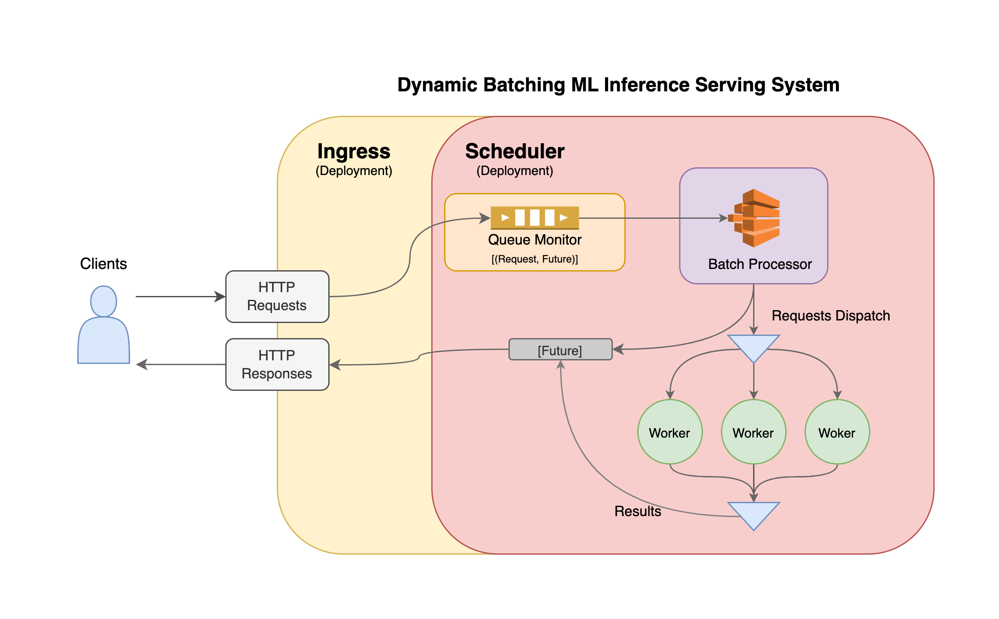

# Dynamic Batching Inference Serving System

## Architecture


## Environment Setup
Install docker image and build container
```
$ docker compose up
```
Enter the bash of the container
```
$ docker exec -it dynamic_batching-ray-1 /bin/bash
```

## Run the server with Ray Serve
Make sure you've entered the bash of the container or has installed the required packages
```
$ cd experiment
$ serve run dynamic_batching:app_builder
```

## Run load test with Locust 
In another terminal, run the following command, and go to http://localhost:8089/ to start the test.
```
$ locust --host http://localhost:8000/
```

